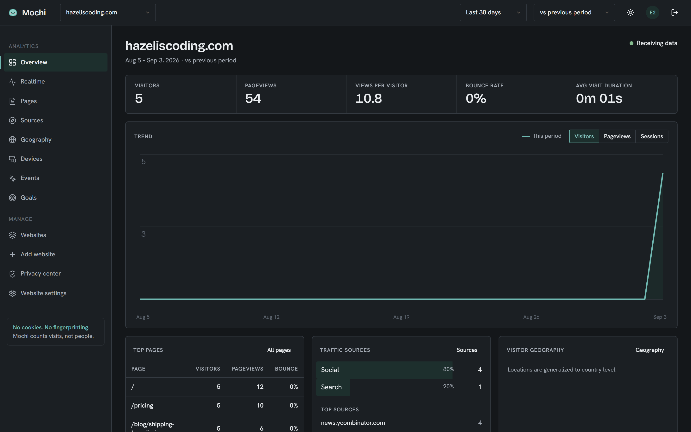
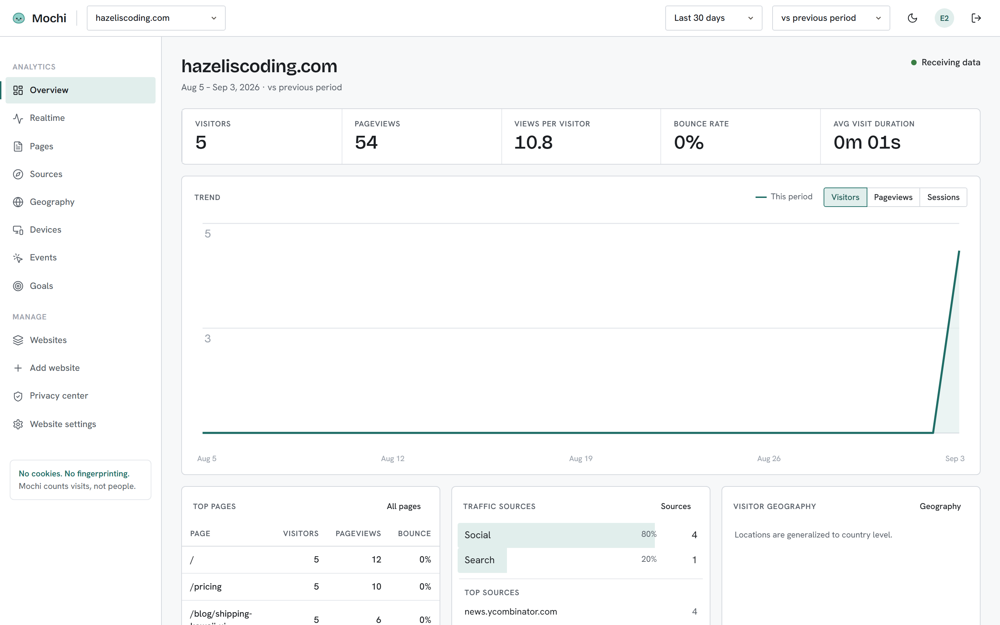
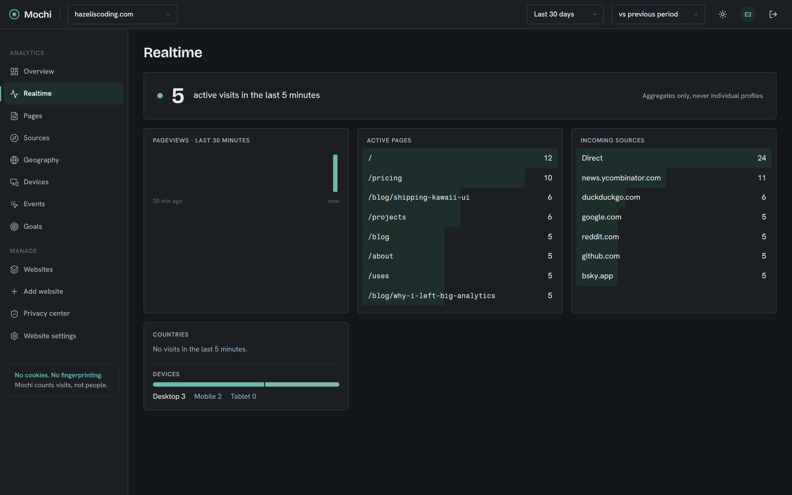
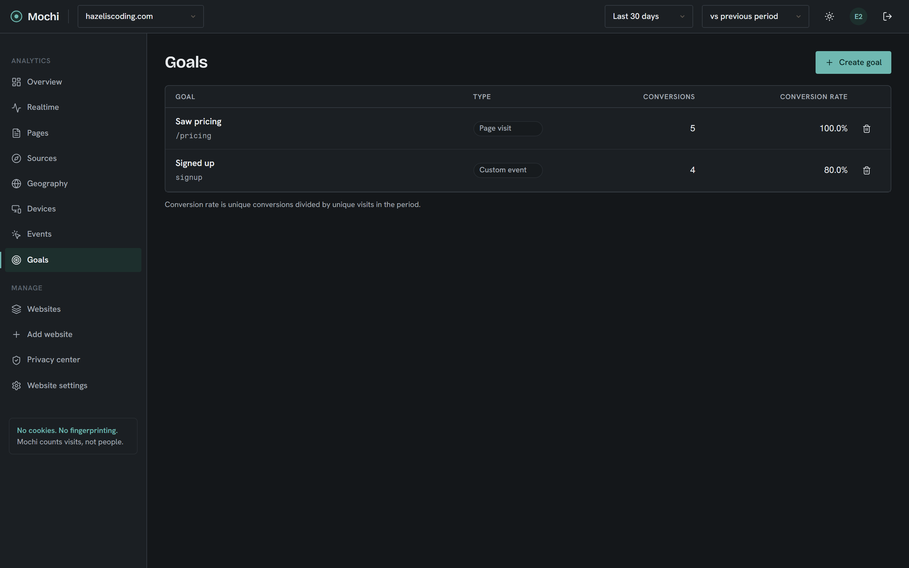
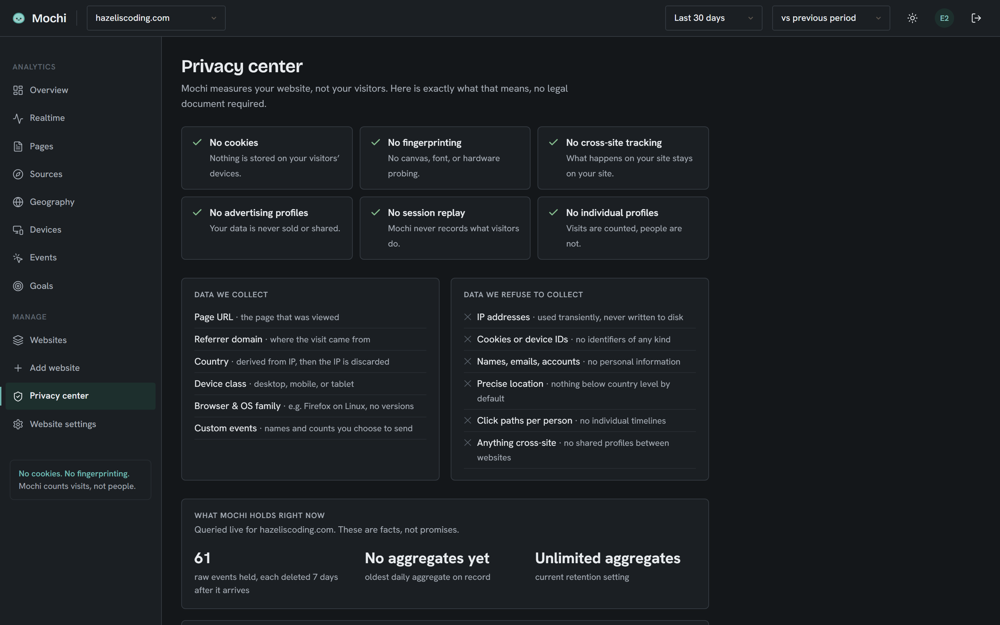
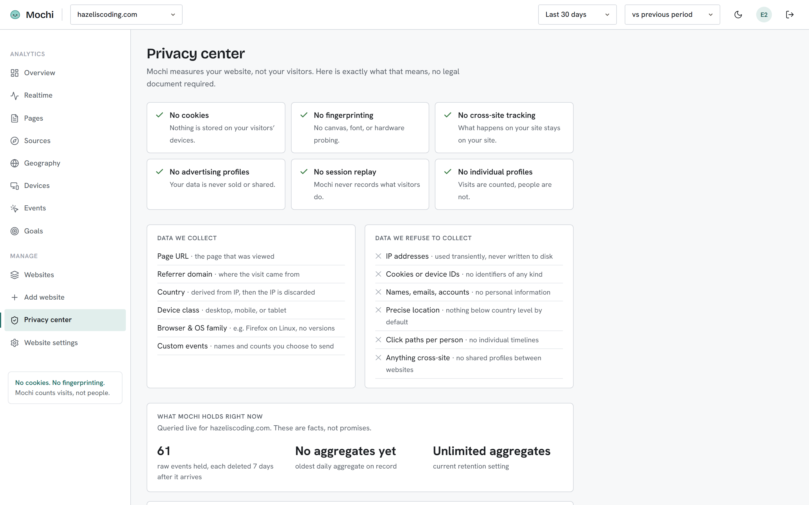

<p align="center"></p>

<h1 align="center">Mochi</h1>

<p align="center"><strong><a href="https://mochi-production-94fe.up.railway.app">mochi-production-94fe.up.railway.app</a></strong></p>

Privacy-first web analytics that counts visits, not people. One dashboard that answers:
**who visits, from where, on what device, and what they did — without storing anything
about anyone.**




## ✨ Features

- 🍡 **No cookies, no fingerprinting, no consent banner needed** — visitors are day-scoped
  salted hashes; the salt is destroyed at the UTC day boundary, so linking the same person
  across two days is cryptographically impossible, not just promised.
- 📊 **The full dashboard** — overview with trends and comparison periods, pages with
  entries/exits/bounce, traffic sources by channel/referrer/campaign, geography, devices,
  custom events with per-page breakdowns.
- ⚡ **Realtime** — active visits in the last 5 minutes, per-minute pageview chart, live
  pages/sources/devices; polls while the page is open.
- 🎯 **Goals** — page-visit and custom-event conversions computed at query time, so a goal
  created today shows its full history immediately.
- 🪶 **1.9 KB tracking snippet** — auto pageviews, SPA route detection, custom events via
  `mochi('event', 'signup')`, a pre-load stub queue, and it bails out entirely on
  DNT / Global Privacy Control. Size and no-storage rules are enforced by tests.
- 🔐 **Sessions done right** — HttpOnly cookie sessions stored server-side as hashes
  (revocable), XSRF double-submit, PBKDF2 passwords, and a first-run setup code printed to
  the server log so a fresh install can't be claimed by a stranger.
- 🛡️ **Privacy center backed by behavior** — a live "what Mochi holds right now" card,
  retention settings that actually purge (30d / 90d / 1y / unlimited aggregates), one-click
  full data export as CSVs, and site deletion that cascades everything.
- 🧊 **Raw events live 7 days, period** — a nightly job rolls them into daily aggregate
  tables and purges; aggregates are the only long-term data and contain counts, never
  per-visit rows.

| Realtime | Goals |
| --- | --- |
|  |  |

| Privacy center | Privacy center — light |
| --- | --- |
|  |  |

## 🛠️ Stack

- **Backend** — .NET 10 minimal API with DDD layering, EF Core + PostgreSQL (in-memory
  fallback for development), server-side cookie sessions.
- **Frontend** — Angular 22 (zoneless, signals) on the Trellis design system, ported from
  the [Mochi Analytics design](https://claude.ai/design/p/e8eb9652-558b-4336-a473-0543ed5bef86)
  (`design-reference/` keeps the imported source).
- **Tests** — 56 backend tests (xUnit + Testcontainers against real Postgres), Vitest unit
  tests, and a 15-test Playwright e2e suite that boots the full stack. All of it runs in CI
  on every push.
- Architecture decisions live in [docs/adr/](docs/adr/): the visitor hash (0001), API
  contracts (0002), storage and rollups (0003), auth (0004).

## 🚀 Getting started

Self-host with one command:

```bash
docker compose up -d
```

Then open http://localhost:8080, grab the one-time setup code from the logs
(`docker compose logs mochi | grep "setup code"`), and create your admin account. Register
your site, paste the snippet it gives you, and traffic starts flowing.

Configuration (environment variables, see `docker-compose.yml`):

| Variable | What it does |
| --- | --- |
| `POSTGRES_PASSWORD` | Database password (change it for anything non-local). |
| `MOCHI_BASE_URL` | Public base URL used in the snippet shown to site owners. |
| `MOCHI_SETUP_CODE` | Pin the first-run setup code instead of reading logs. |
| `Mochi__GeoIpDatabase` | Path to a mounted GeoLite2-Country.mmdb for country stats. |

**Upgrading**: pull the new image and `docker compose up -d` again — database migrations
apply automatically on startup.

## 🧑‍💻 Development

```bash
# API on :5000, no database needed (in-memory mode); setup code prints in the log
cd backend/src/Mochi.Api && dotnet run --urls http://localhost:5000

# dashboard on :4200, proxying /api to the backend
cd frontend && npm install && npx ng serve --proxy-config proxy.conf.json

# tests
cd backend && dotnet test          # unit + integration (needs Docker)
cd frontend && npm test            # vitest
cd frontend && npm run e2e         # playwright, boots both servers itself
```

Set `ConnectionStrings__Mochi` to develop against Postgres; migrations apply on startup.

## 🗺️ Roadmap

See [ROADMAP.md](ROADMAP.md) — v0.1 through v0.7 are done; v1.0 (this release) adds
self-hosting, branding, and a live instance.
