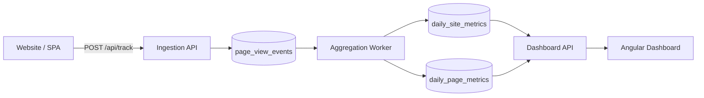

# 🍡 Mochi — Design Documentation

---

[← Previous](02-scope-and-mvp.md) | [Next →](04-data-model.md)

---

## 03-architecture-overview

### High-Level Flow

---

### Architectural Rationale

The architecture reflects a clear separation of responsibilities:

* **Ingestion** is optimized for speed and resilience
* **Raw storage** captures events with minimal processing
* **Aggregation** converts raw data into stable, query-friendly metrics
* **The dashboard** reads only pre-aggregated data

This design avoids expensive ad-hoc queries and scales naturally with traffic volume. Eventual consistency is an acceptable and intentional tradeoff for analytics workloads.

---

[← Previous](02-scope-and-mvp.md) | [Next →](04-data-model.md)
