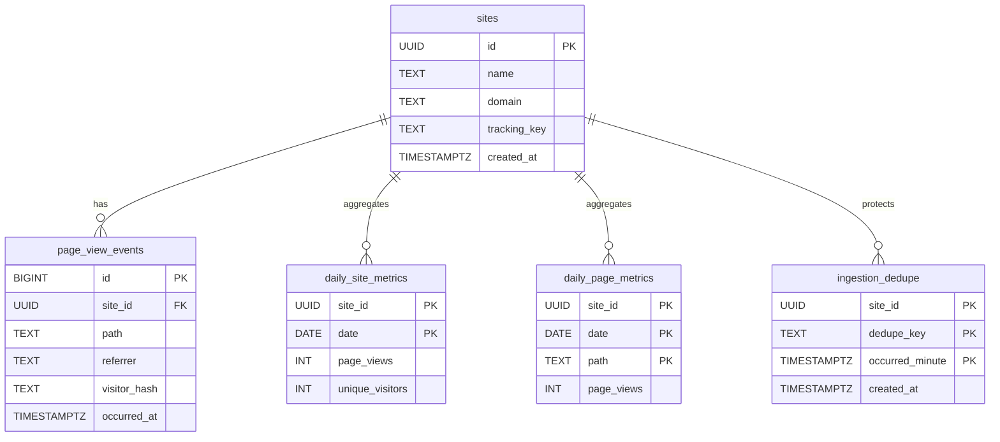

# 🍡 Mochi — Design Documentation

---

[← Previous](03-architecture-overview.md) | [Next →](05-ingestion-and-hashing.md)

---

## 04-data-model

## ERD



### `sites`

The `sites` table represents a logical analytics boundary.

```sql
CREATE TABLE sites (
    id UUID PRIMARY KEY DEFAULT gen_random_uuid(),
    name TEXT NOT NULL,
    domain TEXT NOT NULL,
    tracking_key TEXT NOT NULL UNIQUE,
    created_at TIMESTAMPTZ NOT NULL DEFAULT now()
);
```

Each site is assigned a public tracking key that is safe to embed in client-side code.

---

### `page_view_events` (raw events)

```sql
CREATE TABLE page_view_events (
    id BIGSERIAL PRIMARY KEY,
    site_id UUID NOT NULL REFERENCES sites(id),
    path TEXT NOT NULL,
    referrer TEXT,
    visitor_hash TEXT NOT NULL,
    occurred_at TIMESTAMPTZ NOT NULL
);
```

This table is intentionally write-heavy and append-only. Raw events are retained only long enough to support aggregation.

---

### `daily_site_metrics`

```sql
CREATE TABLE daily_site_metrics (
    site_id UUID NOT NULL REFERENCES sites(id),
    date DATE NOT NULL,
    page_views INT NOT NULL,
    unique_visitors INT NOT NULL,
    PRIMARY KEY (site_id, date)
);
```

This table is the primary data source for dashboard summaries and charts.

---

### `daily_page_metrics`

```sql
CREATE TABLE daily_page_metrics (
    site_id UUID NOT NULL REFERENCES sites(id),
    date DATE NOT NULL,
    path TEXT NOT NULL,
    page_views INT NOT NULL,
    PRIMARY KEY (site_id, date, path)
);
```

Pre-aggregating page-level metrics avoids repeated grouping over raw events at query time.

---

[← Previous](03-architecture-overview.md) | [Next →](05-ingestion-and-hashing.md)
