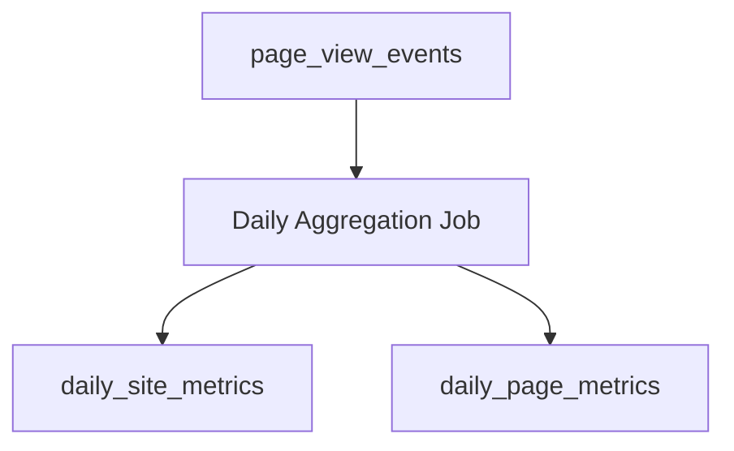

# 🍡 Mochi — Design Documentation

---

[← Previous](06-dedupe-and-bot-filtering.md) | [Next →](08-api-contracts.md)

---

## 07-aggregation-worker

### Purpose

The aggregation worker is responsible for transforming raw events into stable, queryable metrics.

---

### Aggregation Flow



---

### Aggregation State

```sql
CREATE TABLE aggregation_state (
    id SMALLINT PRIMARY KEY DEFAULT 1,
    last_aggregated_day DATE NOT NULL
);
```

Tracking aggregation progress allows the worker to operate incrementally and safely.

---

[← Previous](06-dedupe-and-bot-filtering.md) | [Next →](08-api-contracts.md)
