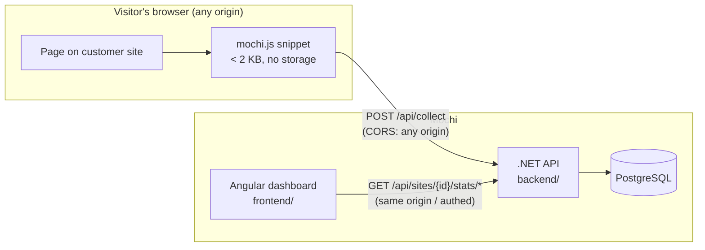

# ADR 0002: API contracts — ingestion, queries, site management

**Status**: Proposed (2026-09-02)

## Context

Three consumers need HTTP contracts before v0.2 code is written:

1. **`mochi.js`** (v0.3) — sends pageviews and custom events from arbitrary
   third-party origins. Must be cross-origin, tiny, and fire-and-forget.
2. **The Angular dashboard** (v0.4) — `frontend/src/app/core/analytics-data.service.ts`
   is the declared seam: *"replace the constants and generated series with HTTP
   calls, keep the shapes."* Its exported interfaces (`PageStats`, `NameVal`,
   `BarRow`, `EventStats`, `GoalStats`, `SiteInfo`) are the contract reference.
3. **Site management** — register a site, get a site ID for the snippet.

One deliberate deviation from "keep the shapes": the mock service stores
*display* values (`val: '3,121'`, `bounce: '28%'`, `dur: '1m 12s'`). The API
returns **raw numbers**; the Angular service — the seam — formats them into the
existing display interfaces. Baking `en-US` thousands separators into a wire
format would be a bug we'd regret by v0.5. The section below maps each frontend
interface to its wire type.

### System context



## Decision

### 1. Ingestion — `POST /api/collect`

The only endpoint browsers on third-party sites ever call.

| Property | Decision |
|---|---|
| CORS | `Access-Control-Allow-Origin: *`, no credentials. Content type `text/plain` (JSON body) so the browser sends no preflight. |
| Auth | None. The site ID is public by design (it's in the page source). |
| Response | `202 Accepted`, empty body — fire-and-forget. Invalid payloads also get `202` (never give trackers-blockers or probes a signal), except malformed JSON → `400`. Unknown site IDs are silently dropped. |
| Server-derived | IP (→ country, then discarded), User-Agent (→ browser/OS/device class), timestamp. The client never sends these. |

Request — pageview:

```json
{
  "site": "MC-7F3K2",
  "type": "pageview",
  "path": "/blog/shipping-kawaii-ui",
  "referrer": "https://news.ycombinator.com/item?id=123"
}
```

Request — custom event (`mochi('event', 'github_link_clicked')`):

```json
{
  "site": "MC-7F3K2",
  "type": "event",
  "name": "github_link_clicked",
  "path": "/projects"
}
```

`referrer` is reduced server-side to a domain + channel classification
(Direct / Search / Referral / Social) and, when UTM parameters are present on
`path`'s query string, a campaign. Full referrer URLs are not stored.

Sequence of a collect call:

```mermaid
sequenceDiagram
    participant B as Browser (customer site)
    participant M as mochi.js
    participant A as POST /api/collect
    participant S as Sessionizer
    participant DB as PostgreSQL

    B->>M: page load / route change / mochi('event', …)
    M->>A: sendBeacon JSON {site, type, path, referrer}
    A-->>M: 202 Accepted (empty)
    Note over A: from here on, async — client is done
    A->>A: validate site ID, check DNT/GPC already honored client-side
    A->>A: GeoIP(ip) → country; parse UA → browser/os/device
    A->>S: visitor_hash = SHA-256(daily_salt ‖ site ‖ ip ‖ ua)[0..8]
    Note over S: ip and raw UA dropped — never persisted
    A->>DB: INSERT event (visitor_hash, path, referrer_domain,<br/>country, device, browser, os, name?, ts)
```

### 2. Query API — `/api/sites/{siteId}/stats/*`

Consumed only by the dashboard (same origin; auth arrives in v0.5). Common query
parameters on every stats endpoint:

| Param | Example | Notes |
|---|---|---|
| `from`, `to` | `2026-08-01`, `2026-08-30` | Inclusive dates, interpreted in the site's configured timezone. |
| `compare` | `previous` \| `year` \| `none` | Maps to the frontend's `compareOptions`. Default `none`. |

When `compare ≠ none`, responses carry a sibling `compare` object with the same
shape so the frontend computes deltas in one place.

| Endpoint | Serves | Wire shape (→ frontend interface) |
|---|---|---|
| `GET …/stats/summary` | Overview metric strip | `{ visitors, pageviews, viewsPerVisitor, bounceRate, avgDurationSec, compare? }` → the `metrics` card values |
| `GET …/stats/timeseries?metric=visitors\|pageviews\|sessions&interval=day` | Overview trend chart | `{ points: [{date, value}], compare? }` → `visitors[]` / `pageviews[]` / `sessions[]` / `prev[]` |
| `GET …/stats/pages` | Pages table | `PageStats[]` with `v, pv, entry, exit: number`, `bounce: number` (0–100), `durationSec: number` (frontend formats to `dur`) |
| `GET …/stats/sources?group=channels\|referrers\|search\|social\|campaigns` | Sources tabs | rows matching `sourceTables` columns; counts as numbers → `BarRow`/`NameVal` |
| `GET …/stats/geo` | Geography | `{ countries: [{code, name, visitors, pct}], regions?: […] }` |
| `GET …/stats/devices` | Devices | `{ classes: BarRow-like, browsers: BarRow-like, os: BarRow-like }` (pct numeric) |
| `GET …/stats/events` | Events page | `EventStats[]` — `conv`/`delta` as numbers, `pages`/`sources` keep the `[string, number][]` tuple shape |
| `GET …/stats/realtime` | Realtime page | see below; polled every 15 s (SSE is a v0.4 option, polling ships first) |

Realtime response:

```json
{
  "activeVisitors": 18,
  "pageviewsPerMinute": [2, 4, 3, 5, 1, "… 30 entries, oldest first"],
  "pages":     [{ "name": "/",        "count": 6 }],
  "sources":   [{ "name": "Direct",   "count": 8 }],
  "countries": [{ "name": "United States", "count": 7 }],
  "devices":   { "desktop": 11, "mobile": 7 }
}
```

"Active" = distinct `visitor_hash` seen in the last 5 minutes. This endpoint
reads raw same-day events only (ADR 0003) and ignores `from`/`to`.

### 3. Goals — `/api/sites/{siteId}/goals`

Goals are *configuration* (unlike stats, they're user-created), so they get CRUD:

```json
// POST /api/sites/MC-7F3K2/goals
{ "name": "Clicked GitHub", "type": "event", "target": "github_link_clicked" }
// → 201  { "id": "g_01J…", "name": "…", "type": "event", "target": "…" }
```

`type` ∈ `page | event | outbound | download` (matches `goalTypes` in the mock).
`GET …/goals/stats?from&to` returns `GoalStats[]` with `conv: number`,
`rate: number`.

### 4. Site management — `/api/sites`

```json
// POST /api/sites
{ "name": "hazeliscoding", "domain": "hazeliscoding.com", "timezone": "Europe/Berlin" }
// → 201
{
  "id": "MC-7F3K2",
  "name": "hazeliscoding",
  "domain": "hazeliscoding.com",
  "timezone": "Europe/Berlin",
  "snippet": "<script defer src=\"https://mochi.example/script.js\" data-site=\"MC-7F3K2\"></script>"
}
```

- `GET /api/sites` → list powering the Websites page (`SiteInfo`): each entry
  includes `viewsLast30d: number`, `activeNow: number`, `status: "active" | "waiting"`
  (frontend derives `tone`/`active` copy).
- `GET /api/sites/{id}`, `PUT /api/sites/{id}` (name, timezone, retention setting),
  `DELETE /api/sites/{id}` (deletes all data for the site — the Privacy Center
  promise depends on this actually cascading).
- Site IDs are short, unguessable-enough, human-readable tokens (`MC-` + 5
  base32 chars, format already shown throughout the frontend). They are public
  identifiers, not secrets.

## Consequences

- The wire format is numbers-first; `analytics-data.service.ts` becomes a thin
  adapter (fetch → format → existing interfaces). v0.4's "replace constants with
  HTTP calls" happens without touching any page component.
- `/api/collect` returning `202` for bad-but-parseable payloads means ingestion
  bugs surface in server metrics/logs, not client behavior — acceptable for
  fire-and-forget, but we must log drop reasons from day one.
- No auth on collect means anyone can inflate a site's numbers if they know its
  public ID. Mitigation deferred (see open questions); Plausible/Fathom accept
  the same risk.
- Preflight-free CORS (`text/plain`) is a deliberate hack shared by every
  analytics vendor; document it in the collect endpoint's code so nobody
  "fixes" the content type.

## Open questions

- **Spam/abuse on collect**: validate `Origin` header against the registered
  domain? Blocks casual spoofing but breaks legitimate proxied setups and
  `Origin`-less beacons. Decide before public exposure, not before v0.2.
- **Rate limiting** on collect (per IP is ironic for a privacy product — per
  site ID?): needed before v1.0, shape TBD.
- **SSE vs. polling for realtime**: polling every 15 s ships in v0.4; revisit if
  it's janky.
- **Auth model** for query endpoints is explicitly out of scope until v0.5; until
  then the API should at least bind to localhost by default in dev docs.
- **`compare=year`** ("vs same period last year") requires ≥ 1 year retention;
  the endpoint should return `compare: null` rather than erroring when data
  doesn't reach back that far.
