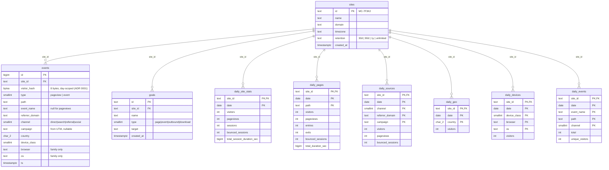

# ADR 0003: Storage, aggregation, and retention

**Status**: Proposed (2026-09-02)

## Context

The database has to serve four workloads with very different shapes:

1. **Ingestion** — small, constant inserts from `/api/collect`.
2. **Realtime** — "distinct visitors in the last 5 minutes", per-minute counts.
3. **Dashboard queries** — 30/90/365-day breakdowns by page, source, country,
   device, event, with a comparison period (ADR 0002).
4. **Retention** — the Privacy Center promises configurable retention
   (30 d / 90 d / 1 y / unlimited *aggregates*) with automatic purge (v0.6).

Two constraints from ADR 0001 shape everything: raw events carry only a 64-bit
`visitor_hash` that is meaningless across day boundaries, and session metrics
(bounce, duration, entry/exit) require grouping same-day events by that hash.

The classic fork: aggregate at query time over raw events (simple, flexible,
slow at scale, and forces long raw retention) vs. pre-computed rollups (fast,
retention-friendly, but you can only answer questions you rolled up).

## Decision

**Hybrid: short-lived raw events + daily rollups.** Raw scrubbed events are kept
for a fixed 7 days; a nightly job (running at the same UTC boundary as salt
rotation, ADR 0001) sessionizes the closed day and writes one row per dimension
value into rollup tables. Dashboard queries for "today" aggregate raw events at
query time; everything older reads rollups. Realtime reads only the last few
minutes of raw events.

Why rollups win here:

- **Privacy alignment**: `visitor_hash` is only meaningful within one day, so raw
  events lose analytical value after the day closes anyway. Rolling up and
  discarding raw data soon after is the privacy promise *implemented*, not just
  stated — after 7 days, nothing event-level exists at all.
- **Retention becomes trivial**: purge = `DELETE FROM daily_* WHERE date < cutoff`.
  "Unlimited aggregates" is safe precisely because rollups contain counts, never
  per-visit rows.
- **Query cost is bounded**: a 90-day pages report reads ≤ 90 × (pages) rollup
  rows instead of millions of events.

The accepted cost: rollups only answer pre-decided questions, and dimensions are
rolled up independently (no "Chrome users from Germany on /blog" cross-filtering).
That matches the current UI exactly — every page shows one-dimensional
breakdowns — and cross-filtering would be a feature ADR of its own.

**Engine: PostgreSQL** (via EF Core migrations). It handles all four workloads at
self-hosted scale, and the v1.0 deployment story is already "Docker compose:
API + DB + frontend". ClickHouse-style column stores are what Plausible needed at
millions of sites; Mochi is not there, and rollups remove most of the pressure.

### Schema

Notes:

- **`events` contains nothing to leak**: no IP, no raw UA, no full referrer URL,
  no query strings (path is stripped of query params except UTM extraction at
  ingest). Losing this table is an availability incident, not a privacy incident.
- Index `events (site_id, ts)` serves realtime and today's queries;
  `daily_* (site_id, date)` is the primary key prefix everywhere, so range scans
  are the natural access path.
- **Sessionization** happens in the rollup job: order the closed day's events per
  `visitor_hash`, split on gaps > 30 min, then derive sessions, bounces
  (single-pageview sessions), duration (last − first event), entries (first
  path), exits (last path). Same-day dashboard queries run the identical logic
  over raw events in SQL/LINQ so "today" and "yesterday" agree in definition.
- **Goal stats are computed at query time** from `daily_pages` / `daily_events`
  by matching the goal's target — goals are cheap filters over existing rollups,
  not their own rollup, so creating a goal retroactively shows history.
- `daily_events.unique_visitors` powers `EventStats.uniq`; conversion rate =
  `unique_visitors / daily_site_stats.visitors`.

### Rollup and purge job

One scheduled background job (hosted service in the API), daily at 00:05 UTC:

1. Rotate the salt (ADR 0001) — first, so late events for the new day hash correctly.
2. Sessionize and roll up the just-closed UTC day into all `daily_*` tables.
   The job is idempotent (delete-and-rewrite the day) so reruns are safe.
3. Purge: delete `events` older than 7 days (fixed, not user-configurable — it's
   an implementation buffer, not a retention feature); delete `daily_*` rows older
   than the site's `retention` setting (`unlimited` keeps aggregates forever, which
   is safe per the promise "daily totals forever, still nothing personal").
4. `DELETE /api/sites/{id}` bypasses all of this: immediate cascading delete.

## Consequences

- The dashboard's date-range queries become `SUM(...) GROUP BY` over small rollup
  tables; comparison periods are just a second date range — no special storage.
- Multi-day "visitors" = sum of daily visitors (overcounts people, per ADR 0001) —
  the rollup design makes this explicit rather than accidental.
- New breakdown dimensions (e.g. UTM content, city-level geo) require a new rollup
  table **and** a backfill story limited to the 7-day raw window — historical data
  for a new dimension is simply unavailable. Say so in release notes when it happens.
- Rollup rows per site per day ≈ (pages + sources + countries + device combos +
  events) — tens to low hundreds. Storage stays negligible for years.
- The rollup job is now correctness-critical: if it fails, "yesterday" vanishes
  from dashboards until rerun. It must alert on failure and be manually
  re-runnable per site/day (an admin endpoint or CLI command in v0.2).

## Open questions

- **Day-bucket timezone mismatch**: rollups close on UTC days, but dashboards
  display dates in the site's timezone (ADR 0002). For non-UTC sites the daily
  buckets are offset by up to ±12 h. Options: accept (Fathom did for years),
  roll up per site-local day, or store hourly rollups and re-bucket at query
  time. Deferring — but decide before v0.4, since it changes rollup keys.
- **SQLite for tiny self-hosted installs**: tempting for a one-container v1.0.
  Postgres is the decision; revisit only if compose friction proves real.
- **Per-minute realtime chart** currently scans raw events; fine at small scale,
  may want a 1-minute in-memory counter later. Not a schema concern yet.
- **Data export** (v0.6) will read rollups — CSV per `daily_*` table seems
  sufficient, but confirm scope when v0.6 is planned.
