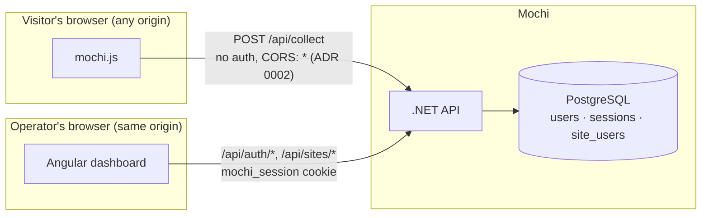
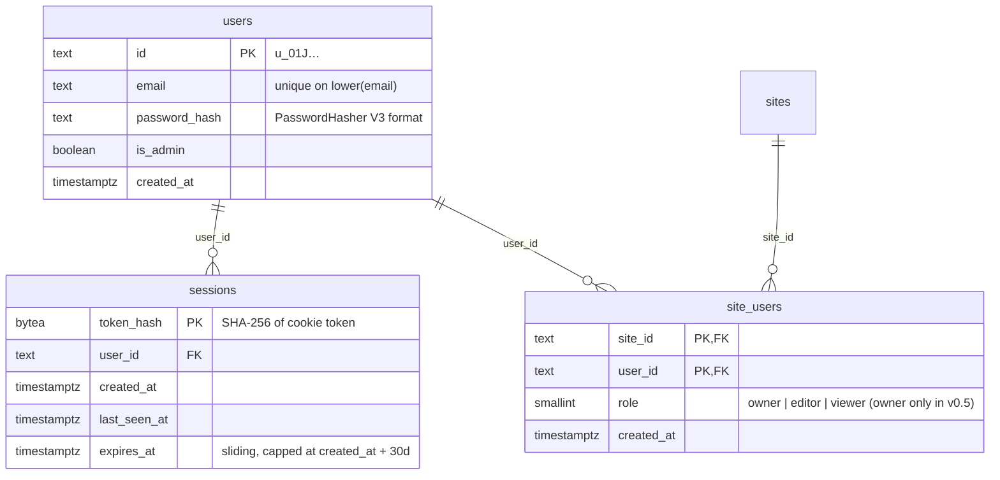

# ADR 0004: Authentication and per-site access

**Status**: Proposed (2026-09-02)

## Context

Everything before v0.5 assumed one trusted operator on localhost: `Program.cs`
carries two comments saying "auth arrives in v0.5, bind to localhost until
then", and ADR 0002 deferred the auth model explicitly. v0.5's promise is "log
in, add several sites, and only see your own" — which needs accounts, sessions,
and a site-membership check on every query endpoint.

Constraints that shape the design:

- **Self-hosted first.** v1.0 is "run Mochi yourself with one command" (Docker
  compose: API + Postgres + static frontend). No external identity provider in
  the core flow, and **no email infrastructure can be assumed** — a default
  install cannot send a verification or password-reset email. Every flow that
  conventionally leans on email needs another answer.
- **Same-origin dashboard.** The Angular app is served from the API's origin in
  production (dev proxy locally), so cookie sessions work without CORS
  gymnastics and browser storage of tokens can be avoided entirely.
- **Ingestion is untouchable.** `POST /api/collect` and `GET /script.js` stay
  completely unauthenticated and CORS-open (ADR 0002). Auth middleware must
  never sit in front of them — a misconfigured cookie policy silently dropping
  pageviews would be the worst possible failure mode for an analytics product.
- **Privacy brand.** No third-party auth SDKs, no analytics on the login page,
  minimal PII: an account is an email and a password hash, nothing more.
- **Stack.** .NET 10 minimal APIs, EF Core + Postgres, DDD layering. Prefer
  built-in ASP.NET Core primitives over frameworks we'd fight later.

### System context, now with an identity boundary



## Decision

### 1. Sessions: HttpOnly cookie, opaque token, server-side store

The dashboard authenticates with a session cookie, not bearer tokens:

| Property | Decision |
|---|---|
| Transport | `Set-Cookie: mochi_session=<token>` — the SPA never sees or stores a credential. No `localStorage`, no `Authorization` header, no token-refresh code in Angular. |
| Token | 256-bit random value, meaningless by itself. The DB stores `SHA-256(token)` — a leaked `sessions` table contains nothing replayable. |
| Attributes | `HttpOnly; Secure; SameSite=Lax; Path=/`. `Secure` has a config escape hatch (`Mochi:AllowInsecureCookies`) for plain-HTTP LAN installs — documented as "your session crosses the wire in cleartext", default off. |
| Lifetime | Sliding 14-day idle expiry, absolute 30-day cap. Sliding renewal touches `expires_at` at most once per hour to avoid a write per request. |
| Store | A `sessions` table in Postgres (schema below). No new infrastructure — the compose stack already has Postgres, and session-validation reads are one indexed point lookup. |
| Revocation | Delete the row. "Log out" deletes one session; "log out everywhere" (and a future password change) deletes all rows for the user. Instant, no denylist, no waiting out a TTL. |
| Plumbing | ASP.NET Core cookie authentication middleware with a custom `ITicketStore` backed by the `sessions` table. The middleware handles cookie parsing, expiry, and principal construction; we own only the store. For `/api/*` paths its redirect-to-login behavior is overridden to return bare `401`s — the SPA handles navigation. |

**Rejected: JWTs / the default encrypted stateless ticket.** Statelessness buys
horizontal-scale token validation Mochi does not need (one API container, one
DB) and costs the thing self-hosters do need: revocation that actually revokes.
An encrypted self-contained cookie is valid until it expires no matter what the
server thinks; "log out everywhere" becomes a key-rotation incident. A JWT in
`localStorage` is strictly worse: any XSS becomes durable account takeover.

**Rejected: full ASP.NET Core Identity.** It drags in email confirmation,
phone numbers, lockout scaffolding, external-login linking, and a dozen tables
for what is here an email and a hash. We take exactly one piece of it
(`PasswordHasher`, below) and keep our own two-column user store.

### 2. CSRF posture

`SameSite=Lax` already blocks the classic cross-site `POST`: browsers won't
attach `mochi_session` to cross-site subresource or form POSTs, only to
top-level GET navigations — and no state-changing Mochi endpoint is a GET.

Lax alone is still a single layer, so mutating endpoints get a second one via
the standard Angular pairing: ASP.NET Core's antiforgery service issues a
readable `XSRF-TOKEN` cookie after login, and Angular's `HttpClient` echoes it
as an `X-XSRF-TOKEN` header on every non-GET request automatically (built-in
cookie-to-header support — zero custom frontend code). The server validates
header against cookie on `POST`/`PUT`/`DELETE` under `/api/`, **except
`/api/collect`**, which is exempt by definition and by test.

### 3. Credential storage

Passwords are hashed with ASP.NET Core's `PasswordHasher<T>` — format V3:
PBKDF2-HMAC-SHA512, 210,000 iterations, 128-bit salt, per-hash format marker so
parameters can be raised later and old hashes rehashed on next login.

Why not Argon2id, the theoretically better choice: there is no first-party
.NET implementation, so it means a native libsodium dependency or a
third-party package on the most security-critical byte-path in the product.
PBKDF2 at these parameters meets OWASP guidance, ships in the framework,
is maintained by Microsoft, and the V3 format gives us a migration path if we
ever swap. Boring wins.

Login failures are uniform: unknown email and wrong password both return
`401 {"error":"invalid_credentials"}` after hashing a dummy password on the
unknown-email path, so response timing and body leak nothing about which
emails have accounts. The log records the real reason.

### 4. First-run setup — closing the takeover window

The email-less constraint bites hardest here: no verification link can prove
the first registrant is the operator. A bare "setup screen shown while zero
users exist" (Plausible's approach) leaves a race: expose a fresh install to
the internet before finishing setup, and whoever finds it first owns it.

Decision — the setup screen exists **and** is gated by a setup code:

- While `users` is empty, every dashboard route redirects to `/setup`, and
  `POST /api/auth/setup` is live. The moment the first user commits, the
  endpoint returns `410 Gone` forever (enforced atomically: the insert runs in
  a serialized transaction with a users-count check, so two racing setups
  cannot both win).
- On startup with zero users, the API generates a one-time setup code and
  prints it to stdout — the same place the operator is already looking after
  `docker compose up`. `MOCHI_SETUP_CODE` can pre-set it for scripted
  installs. The setup form requires it.
- Possession of the code proves the registrant can read the server's logs or
  environment, i.e. is the operator. This is Jupyter's and Grafana's install
  pattern, not an invention.
- The first account gets `is_admin = true` (see §6).

```mermaid
sequenceDiagram
    participant O as Operator
    participant FE as Dashboard (SPA)
    participant A as API
    participant DB as PostgreSQL

    O->>A: docker compose up
    A->>DB: SELECT count(*) FROM users → 0
    A->>A: generate setup code, print to stdout
    O->>FE: open dashboard
    FE->>A: GET /api/auth/session → 401 {setup: true}
    FE->>O: redirect to /setup
    O->>FE: email, password, setup code (from logs)
    FE->>A: POST /api/auth/setup
    A->>A: verify code; hash password (PBKDF2 V3)
    A->>DB: INSERT user (is_admin=true)<br/>serialized txn, fails if users > 0
    A->>DB: INSERT session
    A-->>FE: 201 + Set-Cookie mochi_session (HttpOnly, Lax)
    Note over A: setup endpoint now returns 410 forever
```

The cost is one extra copy-paste at install time. Accepted: it converts "first
to find the URL wins" into "operator wins", and it only ever happens once.

### 5. Authorization: users, sites, and membership

The model is three tables: `users`, `sites`, and a `site_users` join carrying a
role. v0.5 has exactly one role — `owner` — but the join table exists from day
one so teams (v0.5 "then teams" / invitations later) are a row insert, not a
migration. Reserved roles: `editor` (manage goals/settings), `viewer`
(read-only stats).

Rules, enforced in the endpoint layer against the authenticated user id from
the session — never against anything the client sends:

- Creating a site inserts the creator as `owner` in the same transaction.
- Every `/api/sites*` route resolves *the site through the membership*:
  "load site X for user U" is one query joining `site_users`. There is no code
  path that loads a site by id without the user id — a forgotten check is
  structurally hard, not just disciplined-against.
- `GET /api/sites` becomes "sites this user belongs to".

**Status-code semantics.** Anonymous requests to any protected endpoint get
`401` — the SPA's signal to show the login page. An *authenticated* user
hitting a site they don't belong to gets `404`, not `403`: site IDs are short
(`MC-` + 5 base32 chars, ADR 0002) and a `403` would confirm to a logged-in
prober which IDs exist. Nonexistent and not-yours are indistinguishable.

| Surface | v0.4 | v0.5 |
|---|---|---|
| `POST /api/collect`, `GET /script.js` | open | **unchanged — open, CORS `*`** |
| `POST/GET/PUT/DELETE /api/sites*` | open | session + membership (owner for `PUT`/`DELETE`) |
| `GET /api/sites/{id}/stats/*` | open | session + membership |
| `/api/sites/{id}/goals*` incl. new `goals/stats` | open / new | session + membership |
| `POST /api/admin/rollup/{date}` | open (localhost) | session + `is_admin` |
| `/api/auth/setup · login · logout · logout-all · session` | — | new |

```mermaid
sequenceDiagram
    participant U as Operator
    participant FE as Dashboard (SPA)
    participant A as API
    participant DB as PostgreSQL

    U->>FE: email + password
    FE->>A: POST /api/auth/login (X-XSRF-TOKEN)
    A->>DB: SELECT user BY lower(email)
    A->>A: PasswordHasher.Verify (dummy hash if no user)
    alt invalid
        A-->>FE: 401 invalid_credentials (uniform)
    else valid
        A->>A: token = 256-bit random
        A->>DB: INSERT session (sha256(token), user_id, expiries)
        A-->>FE: 204 + Set-Cookie mochi_session=token<br/>HttpOnly; Secure; SameSite=Lax
    end
    FE->>A: GET /api/sites (cookie attached by browser)
    A->>DB: session lookup by sha256(token) → user_id
    A->>DB: sites JOIN site_users WHERE user_id = …
    A-->>FE: only this user's sites
```

### 6. The admin rollup endpoint

`POST /api/admin/rollup/{date}` stops being "localhost-only by convention" and
requires a session whose user has `is_admin = true` — an instance-level flag on
`users`, granted to the setup account, grantable to others later. It stays a
normal authenticated endpoint rather than moving to a CLI because re-running a
failed rollup from the browser is precisely the kind of self-hosting ergonomics
v1.0 promises. Admin actions are written to the structured log (who, what,
when) from day one.

### 7. Explicitly out of scope for v0.5 (but not blocked by it)

- **Teams and invitations** — `site_users.role` and the join table are the
  landing zone; invitation *delivery* needs the email story or share-links.
- **OIDC/SSO for enterprises** — the cookie session is the local artifact an
  OIDC login would establish anyway; adding a provider later changes how a
  session is *created*, not what it *is*.
- **Passkeys** — same shape: another way to establish the same session.
- **API tokens** for programmatic stats access — will be separate
  hashed-at-rest tokens in an `api_tokens` table, not session cookies.
- **Rate limiting on login** — deliberately deferred with ADR 0002's
  collect-endpoint rate limiting (same open question, one solution); the
  uniform-401 behavior above at least denies enumeration meanwhile.
- **Email anything** — verification, reset links, invites — until an optional
  SMTP config exists (not before v0.6).

### Schema

Additions alongside ADR 0003's tables; same conventions (snake_case, text ids
in the goals style, `timestamptz`):



Notes:

- `sessions` rows past `expires_at` are dead on read and swept by the existing
  nightly job (ADR 0003) — no new scheduler.
- Deliberately **not** stored on sessions: IP, user agent, device labels. A
  "your active sessions" screen can come later and will list timestamps only;
  the product that won't fingerprint visitors doesn't fingerprint its owners.
- Deleting a user cascades sessions and memberships. A site whose last owner
  is deleted is orphaned, not deleted — see open questions.

## Consequences

- The frontend's auth surface is small: a login page, a setup page, a route
  guard reacting to `401`s, and Angular's built-in XSRF header. No token
  storage, no refresh logic, no interceptor juggling expiry.
- Session validation adds one indexed Postgres read per request. At self-hosted
  dashboard traffic this is noise; if it ever isn't, a per-instance in-memory
  cache with short TTL is a contained optimization (cost: revocation lag up to
  the TTL — note it when it happens).
- The in-memory dev fallback (no connection string) must implement the user,
  session, and membership stores too, or dev mode silently skips auth —
  integration tests must cover the authenticated paths against both stores.
- Existing v0.4 installs (all dev, pre-release) get the setup screen on first
  boot after upgrade and their existing sites need an owner: the setup
  transaction claims all orphan sites for the first account. Pre-1.0, that
  one-liner is acceptable migration policy.
- The `401`-vs-`404` rule and the membership-scoped site loading need tests
  that *attempt* cross-user access — the ADR 0002 integration-test style
  extended with a second account. A green build should mean "user B cannot
  read user A's stats", not just "user A can".
- Binding to localhost stops being the security model. The compose file can
  expose the API; `/api/collect` was already public-by-design, and everything
  else now authenticates.

## Open questions

- **Password reset without email.** The decided flows never lock out a
  multi-admin install (an admin can reset another user's password once teams
  land), but a sole admin who forgets their password has no in-product path. A
  maintenance command (`dotnet Mochi.Api.dll reset-password <email>`, or
  documented SQL) seems right — decide the exact shape when the CLI story is
  designed, before v1.0 docs.
- **Orphaned sites** (last owner deleted): keep collecting silently, freeze
  ingestion, or auto-assign to an instance admin? Deferred until user deletion
  is actually exposed in the UI — v0.5 has no delete-user surface.
- **`SameSite=Strict` upgrade**: Strict would also strip the cookie from
  top-level navigations into the dashboard (bookmarks still work — the SPA
  re-fetches with the cookie on same-site XHR — but external deep links get a
  login flash). Lax + XSRF header is the decision; revisit only if a concrete
  attack on Lax surfaces.
- **Setup-code delivery UX**: stdout is right for compose, but a future
  one-click PaaS template may not surface logs well. `MOCHI_SETUP_CODE` as an
  env var is the current answer; confirm it suffices when v1.0 packaging is
  real.
- **Login rate limiting / lockout** rides with ADR 0002's rate-limiting
  question — needed before v1.0, shape (per-IP is ironic here too) TBD.
